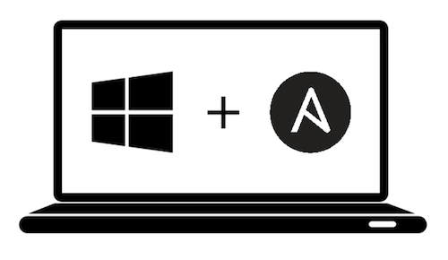

# Windows Ansible Playbook



![badge-gh-actions]
![badge-windows-10]
![badge-windows-11]
![badge-license]

This playbook installs and configures most of the software I use on my Windows 11 machine for software development.

## Contents

- [Playbook capabilities](#playbook-capabilities)
- [Installation](#installation)
- [Windows host prerequisites installation](#prepare-your-windows-host-)
- [Ansible control node prerequisites installation](#ansible-control-node-)
- [Running a specific set of tagged tasks](#running-a-specific-set-of-tagged-tasks)
- [Overriding Defaults](#overriding-defaults)
- [Included Applications / Configuration (Default)](#included-applications--configuration-default)

## Playbook capabilities

> **NOTE:** The Playbook is fully configurable. You can skip or reconfigure any task by [Overriding Defaults](#overriding-defaults).

- **Software**
  - Ensures Bloatware is removed (see default config for a complete list of Bloatware).
  - Ensure software and packages selected by the user are installed via Chocolatey.
- **Windows apps & features**
  - Ensures the Optional Windows Features chosen by the user are installed and enabled.
  - Ensures WSL2 distro selected by the user is installed and enabled.
  - Ensures selected by user volumes are defragmented (in parallel).
- **Windows Settings**
  - **Explorer**
    - Ensures Explorer includes the file extension in file names.
    - Ensures Explorer opens itself to the Computer view.
    - Ensures the Ribbon menu is disabled in Windows Explorer.
    - Ensures Right-click Context Menu enabled (Windows 11).
  - **Start Menu**
    - Ensures Automatic Install of Suggested Apps disabled.
    - Ensures App Suggestions in Start menu disabled.
    - Ensures popup "tips" about Windows disabled.
    - Ensures 'Windows Welcome Experience' disabled.
  - **Taskbar**
    - Ensures 'Search' unpinned from Taskbar.
    - Ensures Task View, Chat, and Cortana are unpinned from Taskbar.
    - Ensures 'News and Interests' unpinned from Taskbar.
    - Ensures 'People' unpinned from Taskbar.
    - Ensures 'Edge', 'Store' other built-in shortcuts unpinned from Taskbar.
  - **Desktop**
    - Ensure Desktop icons are removed.
  - **General**
    - Ensure configured hostname selected by the user is set.
    - Ensure remote desktop services are configured.
    - Ensure the sound scheme is set to 'No sounds'.
    - Ensure the power plan selected by the user is set.
    - Ensure Windows updates are selected by the user installed.
    - Ensures mouse acceleration is disabled.
- **Terminal Settings**
  - Ensures [oh-my-posh](https://ohmyposh.dev/) with the theme chosen by the user is set as a default PowerShell theme engine.

## Installation

### Prepare your Windows host ⏲

#### **This playbook was tested on Windows 10 2004 and Windows 11 21H2 (Pro, Ent). Other versions may work but have not tried.**

Copy and paste the code below into your PowerShell terminal to get your Windows machine ready to work with Ansible.

```powershell
[Net.ServicePointManager]::SecurityProtocol = [Net.SecurityProtocolType]::Tls12
$url = "https://raw.githubusercontent.com/AlexNabokikh/windows-playbook/master/setup.ps1"
$file = "$env:temp\setup.ps1"

(New-Object -TypeName System.Net.WebClient).DownloadFile($url, $file)
powershell.exe -ExecutionPolicy ByPass -File $file -Verbose
```

### Ansible Control node 🕹

1. [Install Ansible](https://docs.ansible.com/ansible/latest/installation_guide/index.html):

   1. Upgrade Pip: `pip3 install --upgrade pip`
   2. Install Ansible: `pip3 install ansible`

2. Clone or download this repository to your local drive.
3. Run `ansible-galaxy install -r requirements.yml` inside this directory to install required Ansible collections.
4. Add the IP address and credentials of your Windows machine into the `inventory` file
5. Run `ansible-playbook main.yml` inside this directory.

### Running a specific set of tagged tasks

You can filter which part of the provisioning process to run by specifying a set of tags using `ansible-playbook` `--tags` flag. The tags available are `choco` , `debloat` , `desktop` , `explorer` , `fonts` , `hostname` , `mouse` , `power` , `sounds` , `start_menu` , `taskbar` , `updates` , `windows_features` , `wsl` .

```sh
ansible-playbook main.yml --tags "choco,wsl"
```

## Overriding Defaults

**NOTE:** You can override any of the defaults configured in `default.config.yml` by creating a `config.yml` file and setting the overrides in that file. For example, you can customize the installed packages and enable/disable specific tasks with something like:

```yaml
configure_hostname: true
custom_hostname: myhostname

install_windows_updates: true
update_categories:
  - Critical Updates
  - Security Updates
  - * # Installs all updates

choco_installed_packages:
  # installs latest version of the Google Chrome while ignoring the package checksum
  - name: googlechrome
    state: latest
    choco_args: --ignorechecksum
  # installs 2.37.1 version of the git
  - name: git
    version: "2.37.1"
  # installs GO, but won't update it
  - golang

install_fonts: true
installed_nerdfonts:
  - Meslo

install_ohmyposh: true
ohmyposh_theme: agnoster

install_windows_features: true
windows_features:
  Microsoft-Hyper-V: true

install_wsl2: true
wsl2_distribution: wsl-archlinux

remove_bloatware: true
bloatware:
  - Microsoft.Messaging
```

## Included Applications / Configuration (Default)

Packages (installed with Chocolatey):

- adobereader
- auto-dark-mode
- awscli
- capture2text
- Firefox
- git
- golang
- jre8
- kubernetes-cli
- microsoft-windows-terminal
- peazip
- powertoys
- python3
- telegram
- terraform
- vlc
- vscode
- zoom

## Author

This project was created by [Alexander Nabokikh](https://www.linkedin.com/in/nabokih/) (initially inspired by [geerlingguy/mac-dev-playbook](https://github.com/geerlingguy/mac-dev-playbook)).

## License

This software is available under the following licenses:

- **[MIT](https://github.com/AlexNabokikh/windows-playbook/blob/master/LICENSE)**

[badge-gh-actions]: https://github.com/AlexNabokikh/windows-playbook/actions/workflows/release.yaml/badge.svg
[badge-windows-11]: https://img.shields.io/badge/OS-Windows%2011%2021H2-blue
[badge-windows-10]: https://img.shields.io/badge/OS-Windows%2010%2020H2-blue
[badge-license]: https://img.shields.io/badge/License-MIT-informational
